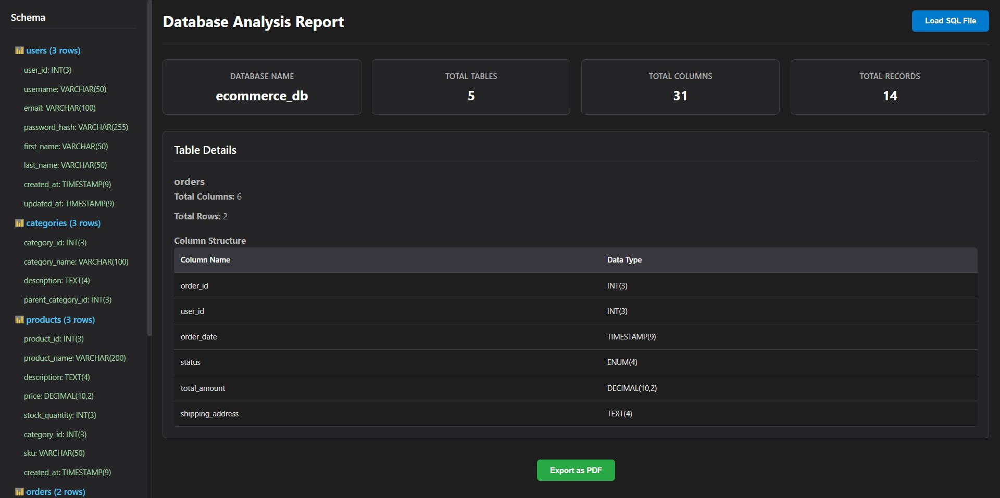

# SQL SchemaLens

[](https://opensource.org/licenses/MIT)

A lightweight, cross-platform desktop tool designed to analyze the structure of a database from an offline SQL dump file. This application was built as a professional technical assessment to demonstrate proficiency in Electron, Node.js, and core development problem-solving.

## Screenshot

*Note: You should replace `screenshot.png` with an actual screenshot of your application.*



## Overview

SQL SchemaLens provides a quick and intuitive way for developers and data analysts to inspect a database schema without needing live server credentials. Simply load any standard SQL dump file (`.sql`), and the tool instantly parses it to generate a comprehensive overview. The user-friendly interface displays key statistics in a central dashboard and provides an interactive schema browser to explore individual tables, their columns, and their data types.

For documentation or sharing, the entire analysis can be exported as a clean, professionally formatted PDF report with a single click.

## Key Features

-   **SQL File Importer:** Load local `.sql` files via a system file dialog.
-   **Robust SQL Parser:** Accurately parses `CREATE TABLE`, `INSERT INTO`, and other SQL statements to build a structural model of the database.
-   **Statistics Dashboard:** At-a-glance view of key metrics like total tables, columns, and records.
-   **Interactive Schema Viewer:** A collapsible tree view allows for easy navigation of all tables and their respective columns.
-   **Detailed Table View:** Select any table from the schema to see a detailed breakdown of its columns, data types, and row count.
-   **PDF Report Export:** Generate a multi-page, professional PDF document detailing the entire database schema for documentation and sharing.

## Technology Stack

-   **Core Framework:** [Electron](https://www.electronjs.org/)
-   **Build Toolchain:** [Electron Forge](https://www.electronforge.io/) with the Webpack template
-   **SQL Parsing Engine:** [node-sql-parser](https://www.npmjs.com/package/node-sql-parser)
-   **PDF Generation:** [jsPDF](https://github.com/parallax/jsPDF) with the [jspdf-autotable](https://github.com/simonbengtsson/jsPDF-AutoTable) plugin
-   **Environment:** [Node.js](https://nodejs.org/)

## Getting Started

### Prerequisites

-   [Node.js](https://nodejs.org/) (which includes npm)
-   [Git](https://git-scm.com/)

### Installation & Running for Development

1.  **Clone the repository:**
    ```bash
    git clone https://github.com/YourUsername/SQL-SchemaLens.git
    ```
2.  **Navigate into the project directory:**
    ```bash
    cd SQL-SchemaLens
    ```
3.  **Install dependencies:**
    ```bash
    npm install
    ```
4.  **Run the application in development mode:**
    ```bash
    npm start
    ```

## Building the Executable

To package the application into a standalone executable for your platform (e.g., a `.exe` on Windows), run the following command:

```bash
npm run make